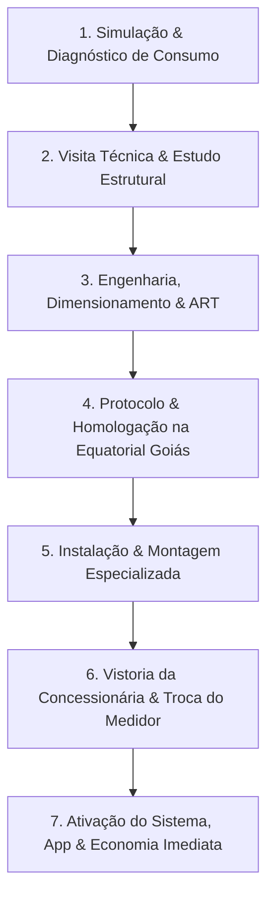

# Relatório de Inteligência Institucional, Técnica e Comercial
## SET SOLAR / SET TECNOLOGIA SOLAR

> **Data de Mapeamento:** Outubro de 2026  
> **Fontes Oficiais:** [setsolar.com.br](https://www.setsolar.com.br), [energia.setsolar.com.br](https://energia.setsolar.com.br), Lovable CRM/Engine ([setsolartrindade.lovable.app](https://setsolartrindade.lovable.app)), Portfólio Fotográfico Oficial Wix, Google Maps, Bases Cadastrais RFB e Noticiário Regional de Goiás.  
> **Status:** Mapeamento 100% Concluído, Auditado e Validado.

---

## 1. Dados Institucionais e Cadastrais

| Atributo | Informação Oficial |
| :--- | :--- |
| **Nome Fantasia** | SET SOLAR / SET TECNOLOGIA SOLAR |
| **Razão Social** | SET SOLAR LTDA |
| **CNPJ** | `37.325.291/0001-06` |
| **Situação Cadastral** | Ativa (Receita Federal do Brasil) |
| **Data de Abertura / Fundação** | 04 de junho de 2020 (04/06/2020) — com atuação pioneira dos fundadores iniciada em 2019 (+7 anos de know-how acumulado no setor) |
| **Capital Social** | R$ 20.000,00 |
| **Sócio-Administrador & Liderança Técnica** | **Davi Carvalho da Mata Barbosa** (Engenheiro com formação técnica acadêmica em Engenharia Elétrica pelo IF Goiano Campus Trindade e Engenharia de Software) |
| **Sócia & Gestão Operacional** | **Rhayssa Souza e Silva da Mata** |
| **Sede Principal** | Avenida Manoel Monteiro, nº 1717, Centro / Setor Oeste, Trindade - GO, CEP: `75392-725` *(unidade anterior/filial registrada: Rua 4, nº 592, Setor Oeste, CEP 75392-710)* |
| **Telefone / WhatsApp Comercial** | `+55 (62) 9 8487-9184` |
| **Telefone / Suporte Secundário** | `+55 (62) 98568-1333` |
| **E-mail Institucional** | `settecnologiasolar@gmail.com` |
| **Horário de Atendimento** | Segunda a Sexta-feira: 08h00 às 18h00 \| Sábado: 08h00 às 12h00 / 13h00 |
| **Concessionária de Conexão** | **Equatorial Energia Goiás** (cálculos de geração e injeção balizados pela Resolução Normativa ANEEL e Lei 14.300/2022) |
| **Slogan Oficial** | *"Tecnologia em Energia Solar — Comprometimento com a preservação do planeta!"* |
| **Promessa Comercial Principal** | *"Reduza em até 95% sua conta no talão de energia."* |
| **Abrangência Geográfica** | Trindade, Goiânia, Senador Canedo, Goianira, Aparecida de Goiânia, Iporá, Avelinópolis, Santa Bárbara de Goiás e mais de 50 municípios goianos |

---

## 2. Missão, Propósito, Visão e Valores

### 2.1 Identidade Corporativa
* **Missão:**  
  > *"Nos dedicamos ao desenvolvimento tecnológico, buscando oferecer aos nossos clientes soluções na área de Energia Solar Fotovoltaica, com os produtos mais modernos do mercado. Cada projeto é executado para atender suas necessidades de segurança e fornecer-lhe o estado de proteção máxima, utilizando tecnologia de ponta."*
* **Propósito:**  
  > *"Sempre iremos entregar para cada cliente a melhor solução, através de uma análise global de todos os seus requisitos. Excederemos a expectativa no estudo preliminar, desenvolvimento e entrega final."*
* **Posicionamento de Mercado:**  
  A Set Solar se posiciona como uma empresa de engenharia e tecnologia prática, aliando o dimensionamento elétrico de alta precisão a uma execução segura, transparente e sem burocracia para o cliente final. Não é apenas uma intermediadora de kits solares, mas uma parceira que assume o projeto de ponta a ponta (Turn-key).

### 2.2 Inovação e Pioneirismo em Eletromobilidade (Ponto Volt)
Além dos sistemas de micro e minigeração distribuída fotovoltaica, a liderança da Set Solar destaca-se pelo pioneirismo na transição energética do estado de Goiás:
* **Participação na Intersolar South America (São Paulo):** Presença contínua nos maiores congressos do setor fotovoltaico internacional, trazendo inovações de ponta em inversores híbridos, baterias de lítio (LiFePO4) e soluções de carregamento veicular.
* **Inauguração de Eletroposto em Trindade:** Implantação de eletroposto de recarga rápida para veículos elétricos na Arena Positiva (Vila João Braz, Trindade - GO), integrando geração solar local com infraestrutura de mobilidade elétrica (marca Ponto Volt Eletropostos).

---

## 3. Portfólio de Soluções e Serviços Especializados

A Set Solar atende a todos os perfis de consumidores com soluções customizadas:

### 3.1 Energia Solar Residencial
* Destinada a casas térreas, sobrados e condomínios horizontais.
* Redução de até 95% na fatura de luz, blindando a família contra aumentos tarifários da Equatorial Goiás e bandeiras amarela e vermelha.
* Valorização patrimonial imediata do imóvel (estimada entre 8% e 12%).
* Instalação rápida, silenciosa e limpa (executada em 1 a 2 dias úteis).
* Estética refinada e fixação que preserva 100% a vedação do telhado.

### 3.2 Energia Solar Comercial e Empresarial
* Foco em empresas, supermercados, postos de combustíveis, clínicas médicas, açougues e colégios.
* Alívio agressivo nas despesas fixas com eletricidade, aumentando a margem de lucro e a competitividade do negócio.
* Payback acelerado (média de 2,5 a 4 anos) com ativos garantidos por mais de 25 anos.
* Selo de sustentabilidade empresarial (ESG), gerando valor para a marca perante a comunidade.
* Casos emblemáticos homologados: **Posto Mak**, **Território da Carne**, **Escola Dinâmica**, **Le Jardam**, **Ailton Farinha** e **Clínica Dr. Paulo**.

### 3.3 Energia Solar para o Agronegócio (Rural)
* Dimensionada para galpões de ordenha mecânica, pivôs de irrigação, granjas de aves, confinamento de gado e residências rurais.
* Instalações reforçadas sobre estruturas metálicas de barracões ou em estruturas de solo (usinas em solo rural).
* Viabilização com linhas de crédito rural específicas (Pronaf, Pronamp, FCO e Plano Safra) com taxas subsidiadas e carência estendida.
* Autonomia e estabilidade energética para operações do campo em municípios do interior goiano (ex.: Iporá e região).

### 3.4 Usinas Solares de Solo e Autoconsumo Remoto
* Parques fotovoltaicos construídos diretamente no solo para investidores ou proprietários de múltiplos imóveis.
* Possibilidade de gerar energia em uma propriedade rural ou lote e compensar créditos em imóveis urbanos cadastrados sob a mesma titularidade (CPF ou CNPJ) na área de concessão da Equatorial Goiás.

### 3.5 Eletromobilidade e Carregadores Veiculares (Wallbox)
* Projetos de infraestrutura elétrica e instalação de carregadores inteligentes para carros elétricos e híbridos plug-in.
* Abastecimento do veículo com energia limpa e gratuita gerada pelo próprio sistema solar da residência ou empresa.

### 3.6 Serviços Técnicos de Pós-Venda e Manutenção
* **Limpeza Especializada de Painéis Fotovoltaicos:** Remoção de poeira e resíduos acumulados com água desmineralizada e equipamentos apropriados, recuperando até 15% a 25% de geração perdida.
* **Manutenção Preventiva e Corretiva:** Inspeção termográfica, reaperto de conexões elétricas, verificação de string boxes e testes de isolamento.
* **Monitoramento Remoto Contínuo 24/7:** Acompanhamento da geração em tempo real via aplicativo no smartphone do cliente e pela central técnica da Set Solar.

---

## 4. Engenharia, Modelo Turn-Key, Equipamentos e Garantias

### 4.1 O Fluxo Turn-Key (Chave na Mão)
A Set Solar gerencia todas as etapas técnicas, burocráticas e regulatórias do projeto, eliminando qualquer esforço do cliente:



1. **Simulação & Diagnóstico de Consumo:** Análise da conta de energia atual para calcular a potência em kWp necessária, economia mensal e retorno do investimento.
2. **Visita Técnica & Estudo Estrutural:** Medição do telhado ou solo, verificação da inclinação, orientação solar, sombreamentos e integridade da estrutura civil/madeiramento.
3. **Engenharia, Dimensionamento & Emissão de ART:** Elaboração do diagrama unifilar, memorial descritivo e anotação de responsabilidade técnica por profissional habilitado.
4. **Protocolo e Homologação na Equatorial Goiás:** Condução rigorosa do processo de solicitação de parecer de acesso conforme a Lei 14.300/2022.
5. **Instalação Especializada:** Equipe técnica própria treinada nas normas regulamentadoras NR-10 (Segurança em Eletricidade) e NR-35 (Trabalho em Altura).
6. **Vistoria Técnica e Medidor Bidirecional:** Acompanhamento da vistoria da Equatorial Goiás para instalação do relógio bidirecional que registra consumo e injeção.
7. **Ativação e Pós-Venda:** Comissionamento do sistema, configuração do monitoramento via aplicativo Wi-Fi no celular do cliente e início da economia.

### 4.2 Fabricantes e Marcas Parceiras (Tier 1)
A Set Solar seleciona rigorosamente componentes de primeira linha global para assegurar mais de 25 anos de durabilidade:

* **Módulos Fotovoltaicos (Painéis Solares):**
  * **Canadian Solar:** Uma das maiores fabricantes globais com módulos de altíssima eficiência e durabilidade comprovada.
  * **Jinko Solar:** Líder mundial com tecnologia N-Type TOPCon de alta geração em temperaturas elevadas.
  * **WEG Solar:** Linha fotovoltaica completa da multinacional brasileira sinônimo de excelência em engenharia elétrica.
* **Inversores Fotovoltaicos e Microinversores:**
  * **WEG:** Inversores de fabricação e suporte técnico de padrão nacional incontestável.
  * **Deye:** Especialista em inversores string e híbridos para sistemas conectados à rede e baterias.
  * **Growatt:** Inversores inteligentes com alta taxa de eficiência e monitoramento digital intuitivo.
  * **Solis / FoxESS:** Tecnologia robusta para aplicações comerciais e industriais.
* **Estruturas de Fixação e Proteção Elétrica:**
  * Perfis de alumínio anodizado de alta resistência mecânica e grampos em aço inox anticorrosão.
  * Dispositivos de Proteção contra Surtos (DPS) e disjuntores CC/CA certificados pelo Inmetro.

### 4.3 Prazos e Políticas de Garantia
* **Garantia de Desempenho e Eficiência dos Módulos:** **25 anos** (garantindo geração linear mínima de 80% a 84% no 25º ano).
* **Garantia contra Defeitos de Fabricação dos Módulos:** **12 a 15 anos**.
* **Garantia dos Inversores:** **5 a 12 anos** de fábrica.
* **Garantia da Instalação e Montagem:** Garantia técnica direta da Set Solar com suporte pós-venda.
* **Vida Útil Projetada:** Superior a **25 a 30 anos**.

### 4.4 Condições Comerciais e Facilidades Financeiras
* **Parcelamento em até 60x:** Condições flexíveis que viabilizam parcelas menores ou equivalentes ao valor economizado na conta de luz.
* **100% Financiado Sem Entrada:** Possibilidade de financiar equipamentos e instalação integralmente.
* **Carência de até 90 a 120 dias:** O cliente começa a economizar antes mesmo de vencer a primeira parcela.
* **Bancos e Fintechs Parceiras:** Santander, BV Financeira, Banco do Brasil, Solfácil, Sicoob e Sicredi.

---

## 5. Números de Impacto e Prova Social

### 5.1 Indicadores Chave de Desempenho (KPIs Oficiais)
* **Projetos Entregues:** **+600 projetos instalados** com sucesso.
* **Clientes Atendidos:** **+700 clientes** gerando sua própria energia.
* **Cidades Atendidas em Goiás:** **+50 municípios**.
* **Tempo de Experiência no Setor:** **7+ anos** de dedicação contínua.
* **Avaliação no Google Maps:** **5.0 Estrelas** (Nota máxima perfeita auditada no Google com 14 avaliações públicas registradas).
* **Economia Média:** **Até 95%** de redução no talão de energia da Equatorial Goiás.

### 5.2 Portfólio de Projetos Reais Auditados (Wix & Base Set Solar)

```
+-------------------------------------------------------------------------------------------------------+
| PORTFÓLIO DE PROJETOS REAIS - SET SOLAR / SET TECNOLOGIA SOLAR                                        |
+--------------------------+-----------------------+---------------------+------------------------------+
| Projeto / Cliente        | Segmento              | Localização         | Destaque Operacional         |
+--------------------------+-----------------------+---------------------+------------------------------+
| Posto Mak                | Comercial / Combust.  | Trindade - GO       | Cobertura metálica em posto  |
| Residencial Le Jardam    | Residencial Premium   | Trindade - GO       | Sistema de alta potência     |
| Território da Carne      | Comercial / Varejo    | Trindade - GO       | Atende câmaras frias         |
| Dr. Paulo                | Clínica & Residência  | Trindade - GO       | Instalação de alto padrão    |
| Escola Dinâmica          | Educacional           | Trindade - GO       | Cobertura escolar sustentável|
| Lourival                 | Comercial / Resid.    | Trindade - GO       | Redução de custos fixos      |
| Ailton Farinha           | Comercial / Distr.    | Trindade - GO       | Forte retorno do investimento|
| Batista                  | Residencial           | Trindade - GO       | Economia mensal contínua     |
| Cliente Residencial      | Residencial           | Trindade - GO       | Redução de R$ 850 p/ R$ 90   |
| Cliente Comercial        | Comércio Varejista    | Goiânia - GO        | Economia de +R$ 2.000/mês    |
| Produtor Rural           | Agronegócio           | Iporá - GO          | Suporte a maquinários e campo|
+--------------------------+-----------------------+---------------------+------------------------------+
```

### 5.3 Depoimentos Reais de Clientes (Google Maps & Landing Page)
* **Depoimento 1 — Residencial (Trindade - GO):**  
  > *"Minha conta de luz caiu de R$ 850 para R$ 90! A equipe da Set Solar foi impecável do início ao fim. Recomendo de olhos fechados."* — ⭐⭐⭐⭐⭐ (5.0)
* **Depoimento 2 — Comercial (Goiânia - GO):**  
  > *"Investimos em energia solar para nossa loja e em 3 anos o sistema já se pagou. Hoje economizamos mais de R$ 2.000 por mês."* — ⭐⭐⭐⭐⭐ (5.0)
* **Depoimento 3 — Agronegócio (Iporá - GO):**  
  > *"A Set Solar entendeu a necessidade da nossa fazenda e entregou um projeto perfeito. Economia real, sem surpresas."* — ⭐⭐⭐⭐⭐ (5.0)
* **Depoimento 4 — Clínica Dr. Paulo (Trindade - GO):**  
  > *"Equipe altamente técnica, o projeto da clínica e residência foi entregue antes do prazo e com acabamento impecável na fixação dos painéis e inversores. Nota 10!"* — ⭐⭐⭐⭐⭐ (5.0)
* **Depoimento 5 — Posto Mak (Trindade - GO):**  
  > *"Instalação segura e homologação rápida junto à Equatorial Goiás. A conta de luz teve redução drástica imediata. Recomendo fortemente a Set Solar."* — ⭐⭐⭐⭐⭐ (5.0)
* **Depoimento 6 — Escola Dinâmica (Trindade - GO):**  
  > *"Excelente trabalho da equipe da Set Solar, desde o dimensionamento inicial do engenheiro Davi até o pós-venda e monitoramento pelo aplicativo. 5 estrelas merecidas!"* — ⭐⭐⭐⭐⭐ (5.0)

---

## 6. Canais e Contatos Oficiais

* **Endereço da Sede:** Av. Manoel Monteiro, nº 1717, Centro / Setor Oeste, Trindade - GO, CEP: `75392-725`
* **Localização Google Maps:** Trindade - GO (Próximo à região central e principais acessos do município)
* **WhatsApp Comercial Principal:** `+55 (62) 9 8487-9184`  
  * Link direto: [wa.me/5562984879184](https://wa.me/5562984879184?text=Olá!%20Gostaria%20de%20fazer%20uma%20simulação%20gratuita%20de%20energia%20solar.)
* **Telefone de Atendimento:** `(62) 98568-1333`
* **E-mail Oficial:** `settecnologiasolar@gmail.com`
* **Website Oficial:** [https://www.setsolar.com.br](https://www.setsolar.com.br)
* **Landing Page de Simulação:** [https://energia.setsolar.com.br](https://energia.setsolar.com.br)
* **Página de Formulário e CRM:** [https://setsolartrindade.lovable.app/formulario](https://setsolartrindade.lovable.app/formulario)
* **Facebook Oficial:** [@settecnologia](https://www.facebook.com/settecnologia)
* **Instagram Oficial:** [@setsolar](https://www.instagram.com/setsolar/)

---

## 7. FAQ Técnica e Comercial (Perguntas Frequentes)

### P1: Quanto realmente posso economizar na fatura de energia?
**R:** Em sistemas conectados à rede (on-grid), a economia chega a **até 95% do valor total da conta de luz**. O cliente passa a pagar apenas a taxa de disponibilidade da concessionária (Equatorial Goiás) e a taxa de iluminação pública municipal.

### P2: Em quanto tempo o investimento se paga (Payback)?
**R:** O tempo médio de retorno varia entre **3 a 5 anos**. Considerando que os módulos possuem garantia de geração de 25 anos e vida útil superior a 30 anos, após o período de retorno o consumidor desfruta de mais de duas décadas de energia limpa com custo praticamente zero.

### P3: O sistema funciona em dias nublados ou chuvosos?
**R:** Sim! Os painéis fotovoltaicos captam a radiação solar (luminosidade difusa), não dependendo unicamente de sol direto e céu sem nuvens. O dimensionamento técnico realizado pela engenharia da Set Solar já computa a média histórica de irradiação solar de Goiás para garantir a produção anual prometida.

### P4: Como funciona o financiamento em até 60x sem entrada?
**R:** A Set Solar possui parcerias com as principais instituições financeiras do país (Santander, BV, Solfácil, Banco do Brasil, Sicredi e Sicoob). O cliente pode parcelar 100% do projeto em até 60 meses com carência de até 90 a 120 dias, de modo que a própria economia na conta de energia ajuda a quitar as parcelas.

### P5: A Set Solar cuida de toda a aprovação na Equatorial Goiás?
**R:** Sim, integralmente. Nosso serviço é 100% Turn-key. Realizamos o projeto elétrico com emissão de ART, protocolamos a solicitação de acesso, acompanhamos o parecer técnico e orientamos a vistoria da concessionária para a substituição pelo medidor bidirecional homologado.

### P6: Preciso de muito espaço no telhado para instalar?
**R:** Não necessariamente. Cada projeto é dimensionado sob medida para o seu consumo elétrico e a área útil disponível. Temos soluções para telhados cerâmicos, metálicos, fibrocimento, lajes de concreto e até mesmo estruturas de solo para residências, empresas ou chácaras.

### P7: Qual é o prazo médio de instalação?
**R:** A montagem física dos painéis e inversores em uma residência costuma ser realizada em apenas **1 a 3 dias úteis**. Em comércios e instalações rurais, o prazo fica entre 3 e 7 dias. O prazo regulatório total da concessionária até a troca do medidor costuma ser concluído entre 30 e 60 dias.

### P8: Como é feita a manutenção dos painéis solares?
**R:** Os painéis possuem película protetora e contam com autolimpeza pelas águas das chuvas. Recomendamos uma lavagem técnica preventiva a cada 6 a 12 meses para retirar poeira e fuligem. A Set Solar oferece serviço especializado de higienização de módulos e monitoramento remoto preventivo.

---

## 8. Recomendações Estratégicas para a Landing Page Set Solar

1. **Destacar Imediatamente a Autoridade de Trindade e Goiás:**
   * Evidenciar os **+600 projetos entregues**, **7+ anos de experiência** e a avaliação perfeita de **5.0 Estrelas no Google Maps**.
2. **Harmonização da Identidade Visual:**
   * Utilizar a paleta oficial mapeada no CRM e nos assets: Azul Marinho Profundo (`#1B3A5C`), Âmbar Solar Dourado (`#D4942A` / `#F59E0B`), Fundo Claro Elegante (`#FAF7F2`) e Branco Puro.
3. **Exibir Logos Oficiais e Fabricantes Tier 1:**
   * Logotipo Set Solar em alta definição (SVG / PNG transparente de alta resolução).
   * Marquee com WEG Solar, Deye, Canadian Solar, Jinko Solar, Growatt e Equatorial Goiás.
4. **Casos Reais com Nomes Locais de Trindade e Goiás:**
   * Posto Mak, Residencial Le Jardam, Território da Carne, Escola Dinâmica e Clínica Dr. Paulo no portfólio e depoimentos.
5. **Call-to-Action Focado no Formulário de Simulação Rápida:**
   * Redirecionamento fluído para o simulador ou WhatsApp direto (`(62) 9 8487-9184`) com mensagem pré-configurada.
